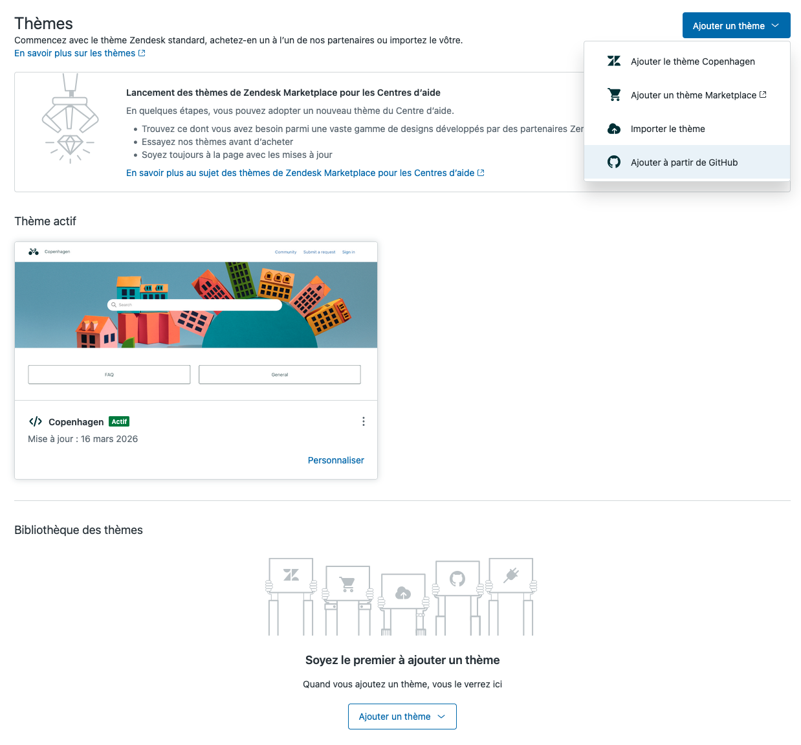

# Custom Copenhagen-Based Zendesk Theme

This repository contains a custom Zendesk Guide theme based on the **Copenhagen** base theme, tailored for [Amsel Suite](https://amsel-suite.zendesk.com). The theme includes custom styling, layouts, and enhancements to improve the end-user experience while maintaining the clean, responsive design of the original Copenhagen theme.

## Installation

To use this theme in your Zendesk Guide:

Download the repository or clone it:

```bash
git clone https://github.com/your-username/custom-copenhagen-zendesk-theme.git
```

Or use Zendesk's `Import from github` feature :


